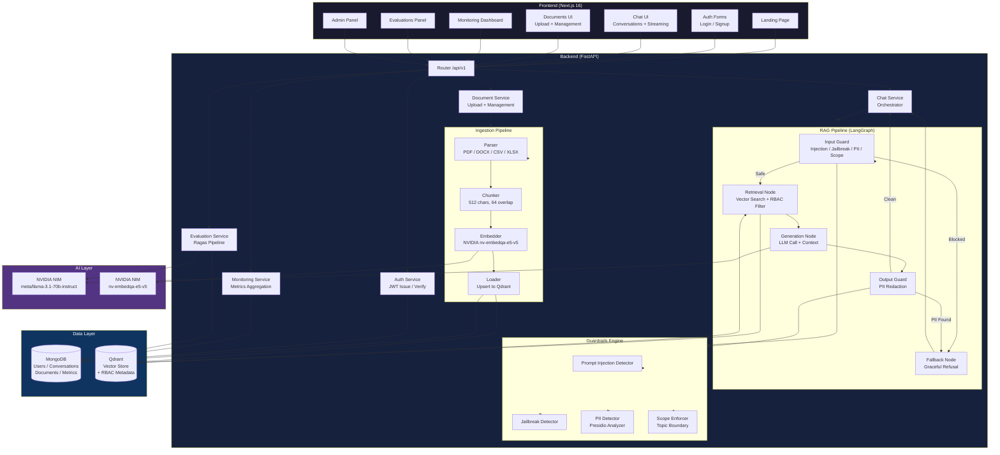
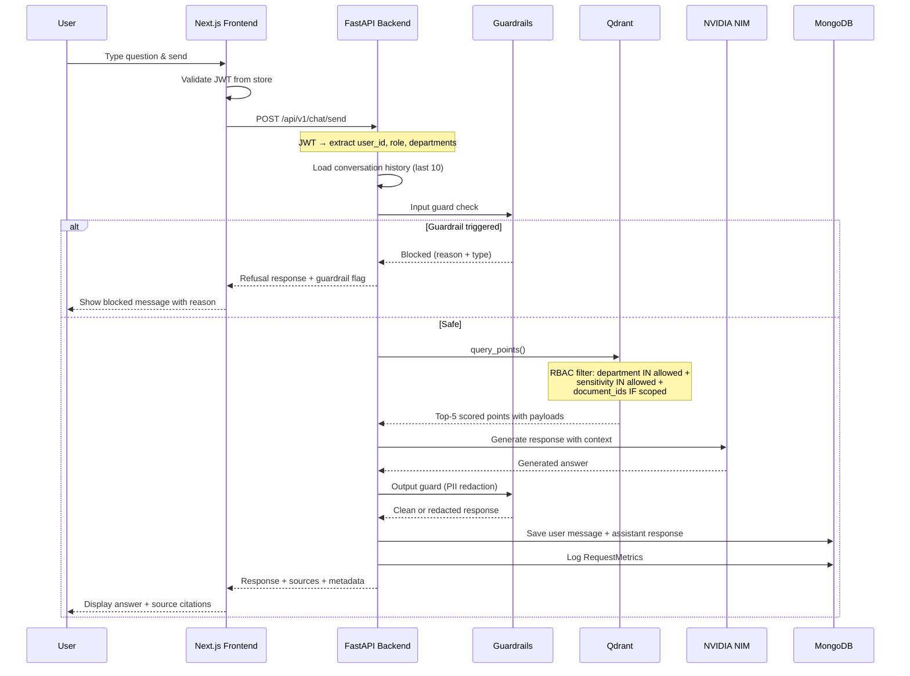
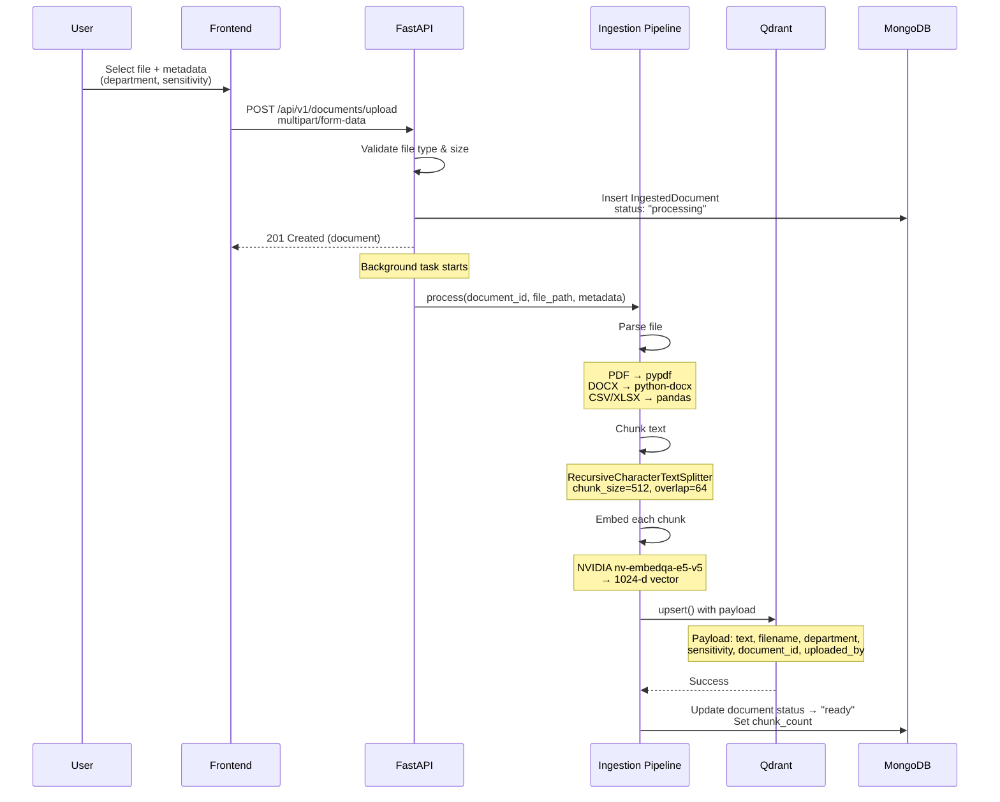
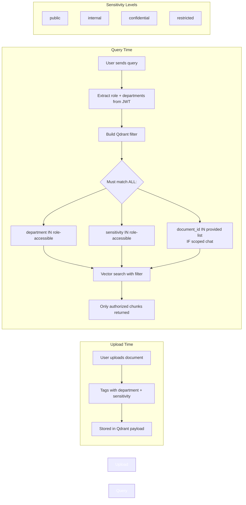
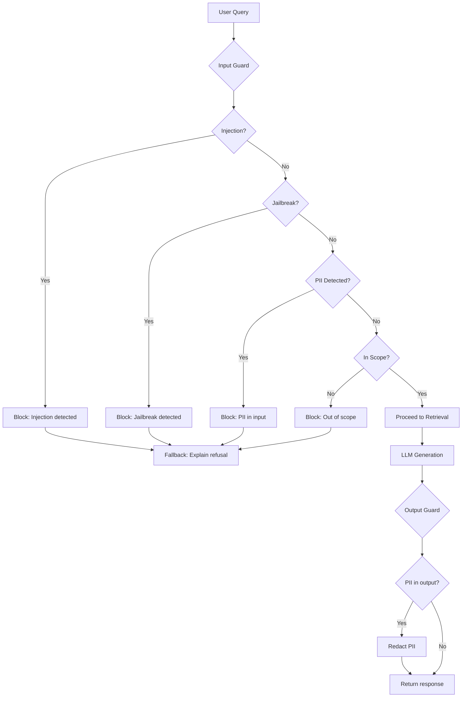
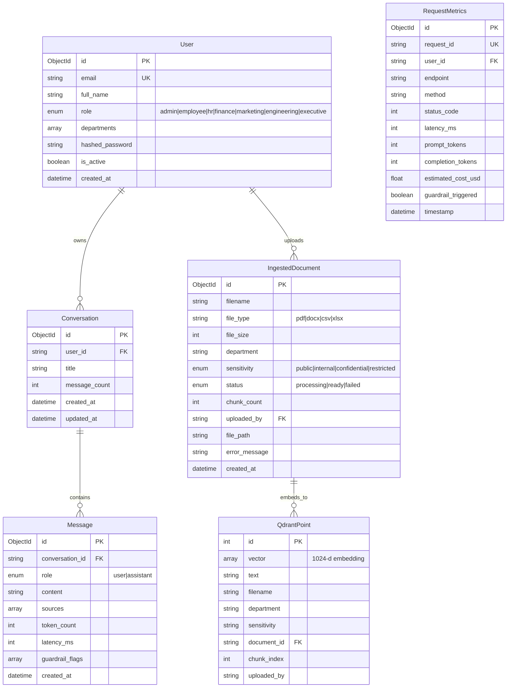

# Architecture

## System Overview

```mermaid
graph TB
    subgraph Frontend["Frontend (Next.js 16)"]
        LP[Landing Page]
        AF[Auth Forms<br/>Login / Signup]
        CH[Chat UI<br/>Conversations + Streaming]
        DC[Documents UI<br/>Upload + Management]
        MO[Monitoring Dashboard]
        EV[Evaluations Panel]
        AD[Admin Panel]
    end

    subgraph Backend["Backend (FastAPI)"]
        RT[Router /api/v1]
        AUTH[Auth Service<br/>JWT Issue / Verify]
        CS[Chat Service<br/>Orchestrator]
        DS[Document Service<br/>Upload + Management]
        ES[Evaluation Service<br/>Ragas Pipeline]
        MS[Monitoring Service<br/>Metrics Aggregation]

        subgraph RAG["RAG Pipeline (LangGraph)"]
            IG[Input Guard<br/>Injection / Jailbreak / PII / Scope]
            RET[Retrieval Node<br/>Vector Search + RBAC Filter]
            GEN[Generation Node<br/>LLM Call + Context]
            OG[Output Guard<br/>PII Redaction]
            FB[Fallback Node<br/>Graceful Refusal]
        end

        subgraph ING["Ingestion Pipeline"]
            PR[Parser<br/>PDF / DOCX / CSV / XLSX]
            CHK[Chunker<br/>512 chars, 64 overlap]
            EMB[Embedder<br/>NVIDIA nv-embedqa-e5-v5]
            LD[Loader<br/>Upsert to Qdrant]
        end

        subgraph GRD["Guardrails Engine"]
            INJ[Prompt Injection Detector]
            JLB[Jailbreak Detector]
            PII[PII Detector<br/>Presidio Analyzer]
            SCP[Scope Enforcer<br/>Topic Boundary]
        end
    end

    subgraph Storage["Data Layer"]
        MDB[(MongoDB<br/>Users / Conversations<br/>Documents / Metrics)]
        QD[(Qdrant<br/>Vector Store<br/>+ RBAC Metadata)]
    end

    subgraph AI["AI Layer"]
        NIM_CHAT[NVIDIA NIM<br/>meta/llama-3.1-70b-instruct]
        NIM_EMB[NVIDIA NIM<br/>nv-embedqa-e5-v5]
    end

    %% Frontend → Backend
    LP --> RT
    AF --> RT
    CH --> RT
    DC --> RT
    MO --> RT
    EV --> RT
    AD --> RT

    %% Backend routing
    RT --> AUTH
    RT --> CS
    RT --> DS
    RT --> ES
    RT --> MS

    %% Chat flow
    CS --> RAG
    RAG --> IG
    IG -->|Safe| RET
    IG -->|Blocked| FB
    RET --> GEN
    GEN --> OG
    OG -->|Clean| CS
    OG -->|PII Found| FB
    FB --> CS

    %% Retrieval
    RET --> QD
    QD --> RET

    %% Generation
    GEN --> NIM_CHAT

    %% Ingestion flow
    DS --> ING
    ING --> PR
    PR --> CHK
    CHK --> EMB
    EMB --> NIM_EMB
    EMB --> LD
    LD --> QD
    LD --> MDB

    %% Auth
    AUTH --> MDB

    %% Monitoring
    MS --> MDB

    %% Evaluation
    ES --> MDB
    ES --> NIM_CHAT

    %% Guardrails
    IG --> GRD
    GRD --> INJ
    GRD --> JLB
    GRD --> PII
    GRD --> SCP
    OG --> GRD

    style Frontend fill:#1a1a2e,color:#fff
    style Backend fill:#16213e,color:#fff
    style Storage fill:#0f3460,color:#fff
    style AI fill:#533483,color:#fff
```

## Request Lifecycle — Chat

```mermaid
sequenceDiagram
    participant U as User
    participant FE as Next.js Frontend
    participant BE as FastAPI Backend
    participant GR as Guardrails
    participant QD as Qdrant
    participant LLM as NVIDIA NIM
    participant DB as MongoDB

    U->>FE: Type question & send
    FE->>FE: Validate JWT from store
    FE->>BE: POST /api/v1/chat/send
    Note over BE: JWT → extract user_id, role, departments

    BE->>BE: Load conversation history (last 10)
    BE->>GR: Input guard check

    alt Guardrail triggered
        GR-->>BE: Blocked (reason + type)
        BE-->>FE: Refusal response + guardrail flag
        FE-->>U: Show blocked message with reason
    else Safe
        BE->>QD: query_points()
        Note over QD: RBAC filter: department IN allowed +<br/>sensitivity IN allowed +<br/>document_ids IF scoped
        QD-->>BE: Top-5 scored points with payloads
        BE->>LLM: Generate response with context
        LLM-->>BE: Generated answer
        BE->>GR: Output guard (PII redaction)
        GR-->>BE: Clean or redacted response
        BE->>DB: Save user message + assistant response
        BE->>DB: Log RequestMetrics
        BE-->>FE: Response + sources + metadata
        FE-->>U: Display answer + source citations
    end
```

## Document Ingestion Flow

```mermaid
sequenceDiagram
    participant U as User
    participant FE as Frontend
    participant BE as FastAPI
    participant ING as Ingestion Pipeline
    participant QD as Qdrant
    participant DB as MongoDB

    U->>FE: Select file + metadata<br/>(department, sensitivity)
    FE->>BE: POST /api/v1/documents/upload<br/>multipart/form-data
    BE->>BE: Validate file type & size
    BE->>DB: Insert IngestedDocument<br/>status: "processing"
    BE-->>FE: 201 Created (document)

    Note over BE: Background task starts

    BE->>ING: process(document_id, file_path, metadata)

    ING->>ING: Parse file
    Note over ING: PDF → pypdf<br/>DOCX → python-docx<br/>CSV/XLSX → pandas

    ING->>ING: Chunk text
    Note over ING: RecursiveCharacterTextSplitter<br/>chunk_size=512, overlap=64

    ING->>ING: Embed each chunk
    Note over ING: NVIDIA nv-embedqa-e5-v5<br/>→ 1024-d vector

    ING->>QD: upsert() with payload
    Note over QD: Payload: text, filename, department,<br/>sensitivity, document_id, uploaded_by

    QD-->>ING: Success

    ING->>DB: Update document status → "ready"<br/>Set chunk_count
```

## RBAC Enforcement

```mermaid
graph LR
    subgraph Upload Time
        A[User uploads document] --> B[Tags with department + sensitivity]
        B --> C[Stored in Qdrant payload]
    end

    subgraph Query Time
        D[User sends query] --> E[Extract role + departments from JWT]
        E --> F[Build Qdrant filter]
        F --> G{Must match ALL:}
        G --> H[department IN role-accessible]
        G --> I[sensitivity IN role-accessible]
        G --> J[document_id IN provided list<br/>IF scoped chat]
        H & I & J --> K[Vector search with filter]
        K --> L[Only authorized chunks returned]
    end

    subgraph Sensitivity Levels
        M[public]
        N[internal]
        O[confidential]
        P[restricted]
    end

    style Upload Time fill:#1a3a2e,color:#fff
    style Query Time fill:#3a1a2e,color:#fff
```

## Guardrails Pipeline

```mermaid
flowchart TD
    Q[User Query] --> IG{Input Guard}

    IG --> INJ{Injection?}
    INJ -->|Yes| BLOCK1[Block: Injection detected]
    INJ -->|No| JLB{Jailbreak?}

    JLB -->|Yes| BLOCK2[Block: Jailbreak detected]
    JLB -->|No| PII{PII Detected?}

    PII -->|Yes| BLOCK3[Block: PII in input]
    PII -->|No| SCP{In Scope?}

    SCP -->|No| BLOCK4[Block: Out of scope]
    SCP -->|Yes| RET[Proceed to Retrieval]

    RET --> GEN[LLM Generation]
    GEN --> OG{Output Guard}

    OG --> PII_OUT{PII in output?}
    PII_OUT -->|Yes| REDACT[Redact PII]
    PII_OUT -->|No| RESPOND[Return response]
    REDACT --> RESPOND

    BLOCK1 --> FALLBACK[Fallback: Explain refusal]
    BLOCK2 --> FALLBACK
    BLOCK3 --> FALLBACK
    BLOCK4 --> FALLBACK
```

## Data Model Relationships

```mermaid
erDiagram
    User ||--o{ Conversation : owns
    User ||--o{ IngestedDocument : uploads
    Conversation ||--o{ Message : contains
    IngestedDocument ||--o{ QdrantPoint : embeds_to

    User {
        ObjectId id PK
        string email UK
        string full_name
        enum role "admin|employee|hr|finance|marketing|engineering|executive"
        array departments
        string hashed_password
        boolean is_active
        datetime created_at
    }

    Conversation {
        ObjectId id PK
        string user_id FK
        string title
        int message_count
        datetime created_at
        datetime updated_at
    }

    Message {
        ObjectId id PK
        string conversation_id FK
        enum role "user|assistant"
        string content
        array sources
        int token_count
        int latency_ms
        array guardrail_flags
        datetime created_at
    }

    IngestedDocument {
        ObjectId id PK
        string filename
        string file_type "pdf|docx|csv|xlsx"
        int file_size
        string department
        enum sensitivity "public|internal|confidential|restricted"
        enum status "processing|ready|failed"
        int chunk_count
        string uploaded_by FK
        string file_path
        string error_message
        datetime created_at
    }

    QdrantPoint {
        int id PK
        array vector "1024-d embedding"
        string text
        string filename
        string department
        string sensitivity
        string document_id FK
        int chunk_index
        string uploaded_by
    }

    RequestMetrics {
        ObjectId id PK
        string request_id UK
        string user_id FK
        string endpoint
        string method
        int status_code
        int latency_ms
        int prompt_tokens
        int completion_tokens
        float estimated_cost_usd
        boolean guardrail_triggered
        datetime timestamp
    }
```
