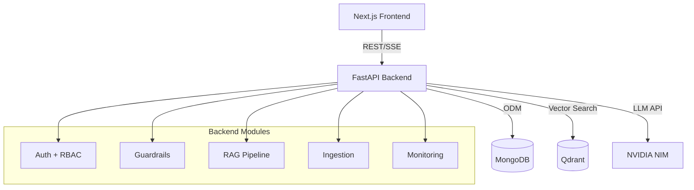
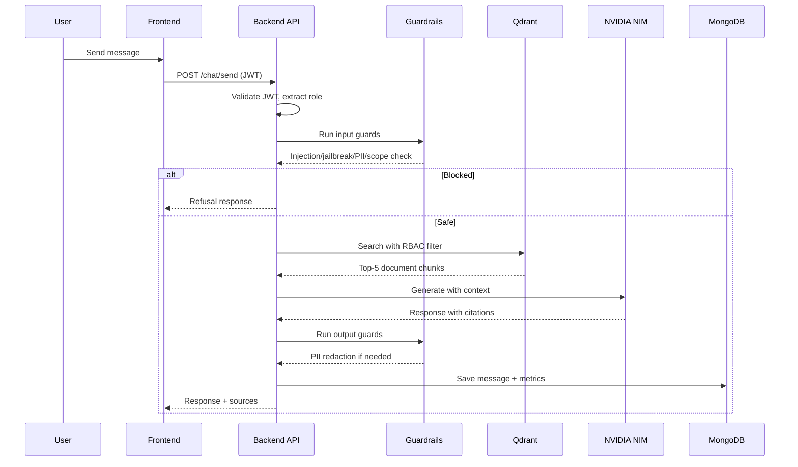
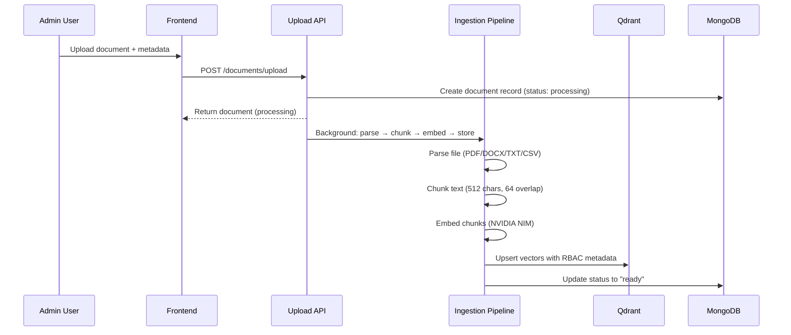
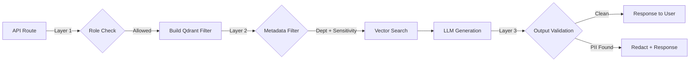

# Architecture

## System Overview

The Enterprise Knowledge Assistant is a full-stack RAG application with secure role-based access control, built on a modular architecture.

## Request Lifecycle (Chat)

## Document Ingestion Flow

## RBAC Enforcement Points

## Technology Decisions

| Decision | Choice | Rationale |
|----------|--------|-----------|
| MongoDB over PostgreSQL | Beanie ODM | User-specified, flexible schema for documents |
| Qdrant over Pinecone/Weaviate | Self-hosted, metadata filtering | RBAC at retrieval time via payload filters |
| NVIDIA NIM | Configurable LLM provider | Enterprise-grade, OpenAI-compatible API |
| JWT over sessions | Stateless auth | Scales horizontally, works with microservices |
| Background asyncio tasks | Simple async | Can upgrade to Celery/Redis later |

## Scaling Considerations

- **Horizontal**: Backend is stateless, can scale behind load balancer
- **Caching**: Add Redis for conversation history and frequent queries
- **Queue**: Replace asyncio.create_task with Celery for reliable ingestion
- **CDN**: Frontend can be deployed to Vercel/Cloudflare
- **Vector DB**: Qdrant supports distributed mode for larger datasets
